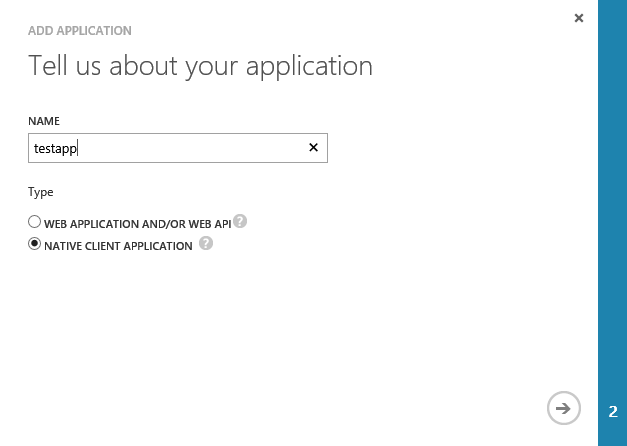
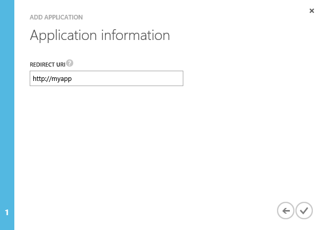
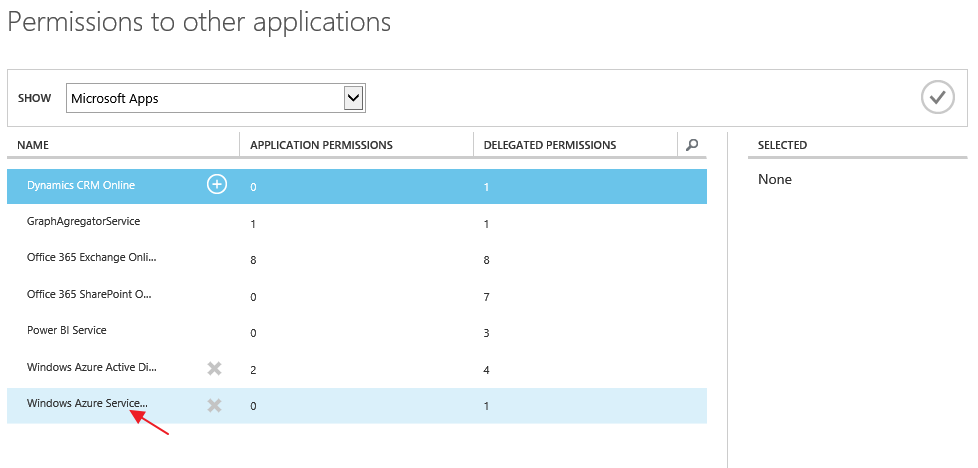
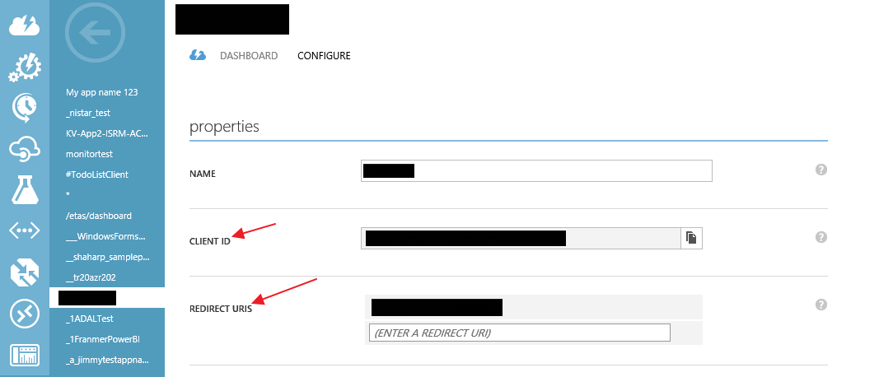

# ARM-RESTler
**ARM RESTler** aka **Azure Resource Manager REST_enabler** allows you to get the bearer token needed to authenticate and make REST calls against ARM

##Download
* https://github.com/singhkay/ARM-RESTler/releases/download/release/ARM.RESTler.Setup.msi
* Windows smart screen might block the setup exe from running. To avoid this **Right click** the msi file, select **Properties** and hit **Unblock**

##Solution Dependencies
* If you decide to download the code and want to open up the Visual Studio solution, install the [Microsoft Visual Studio Installer Projects](https://visualstudiogallery.msdn.microsoft.com/9abe329c-9bba-44a1-be59-0fbf6151054d) first which is used to generate the setup file.
* You might see a packages missing error. Use the auto package restore mechanism from package manager console

##Screenshots

* save button - Use this button to save your input so you don't have to find all the endpoints, ids again
* load button - Loads the previously saved state
* connect/tutorial button - Brings you to this repo and guide

##Instructions
To get the various input you first need to setup an Active Directory application. Read here on how to do this and get the required input
[Authenticating Azure Resource Manager requests](https://msdn.microsoft.com/en-us/library/azure/dn790557.aspx)

Before you do any of the steps in this section, you need to log into the [Azure Management Portal](http://manage.windowsazure.com/)

###Step 1. Add an application to your Azure Active Directory tenant

1. Towards the bottom of the left menu, click Active Directory like in the image below.

2. Click your default directory tenant that's available and head to the **Applications** tab and click **Add**

3. Enter the name of the application, select Native Client Application, and then click the right arrow

4. Enter the Redirect URI for your application and click the checkmark to create the application

 
###Step 2. Configure permissions for the application

1. Click on your app and head to **Configure** tab

2. In the **permissions for other applications** section, click **Add application**

3. Click **Select application**, and then select **Windows Azure Service Management API**.

4. Click Delegated Permissions for the Windows Azure Service Management APIs, and then select Access Azure Service Management.

 
###Step 3. Getting input values for the ARM RESTler interface
1. Once on the application **configure** page, you can get the **clientId** and **Redirect Uri**

2. For getting the **OAuth endpoint**, you need to back out of the application page into the default directory page

That's it! You're all set :)
